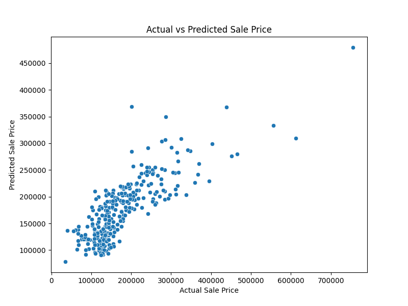

# 🏡 House Price Prediction using Linear Regression

This project implements a **Linear Regression** model to predict house prices based on important features from the Ames Housing dataset such as square footage, number of bedrooms, and number of bathrooms.

---

## 📊 Features Used

- `GrLivArea`: Above ground living area (in square feet)
- `BedroomAbvGr`: Number of bedrooms above ground
- `FullBath + HalfBath`: Combined into `TotalBath`

---

## 🧠 Model Summary

- **Model**: Linear Regression
- **Library**: Scikit-learn
- **Train/Test Split**: 80/20
- **Metrics**:
  - Mean Squared Error (MSE)
  - R² Score
- **Visualization**: Scatter plot of actual vs predicted sale prices

---

## 📁 Project Structure

```bash
house_price_prediction/
├── train.csv
├── model.py
├── README.md
├── requirements.txt
```

---

## 🚀 How to Run

### 1. Clone the Repository

```bash
git clone https://github.com/YOUR_USERNAME/house-price-prediction.git
cd house-price-prediction
```

### 2. Install Dependencies

```bash
pip install -r requirements.txt
```

### 3. Run the Project

```bash
python model.py
```

---

## 🖼 Output Sample

A scatter plot is generated comparing actual vs predicted house sale prices.

> 

---

## 📦 Requirements

- Python 3.7+
- pandas
- scikit-learn
- matplotlib
- seaborn

Install manually if needed:
```bash
pip install pandas scikit-learn matplotlib seaborn
```

---

## 👨‍💻 Author

**Dheeraj Konakalla**  
📧 dheerajkonakalla0412@gmail.com  
🔗 [GitHub](https://github.com/dheerajkonakalla4) • [LinkedIn](https://www.linkedin.com/in/dheeraj-konakalla)

---


## 📜 License

This project is open-sourced under the MIT License.
